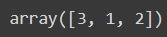

# Exno:2
# AIM:

To perform Exploratory Data Analysis on the given data set.
      
# EXPLANATION:

The primary aim with exploratory analysis is to examine the data for distribution, outliers and anomalies to direct specific testing of your hypothesis.
  
# ALGORITHM:

STEP 1: Import the required packages to perform Data Cleansing,Removing Outliers and Exploratory Data Analysis.

STEP 2: Replace the null value using any one of the method from mode,median and mean based on the dataset available.

STEP 3: Use boxplot method to analyze the outliers of the given dataset.

STEP 4: Remove the outliers using Inter Quantile Range method.

STEP 5: Use Countplot method to analyze in a graphical method for categorical data.

STEP 6: Use displot method to represent the univariate distribution of data.

STEP 7: Use cross tabulation method to quantitatively analyze the relationship between multiple variables.

STEP 8: Use heatmap method of representation to show relationships between two variables, one plotted on each axis.

## CODING AND OUTPUT
```py
DEVELOPED BY: SATHISH R
REG NO: 212222100048
```

```py
import pandas as pd
import numpy as np
import matplotlib.pyplot as plt
import seaborn as sns
dt=pd.read_csv("titanic.csv")
dt
```

```py
dt.info()
```

```py
dt.shape
```

```py
dt.set_index('PassengerId',inplace=True)
dt.describe()
```


### CATEGORICAL DATA ANALYSIS
```py
dt.nunique()
```

```py
dt["Survived"].value_counts()
```

```py
per=(dt["Survived"].value_counts()/dt.shape[0]*100).round(2)
per
```


### UNIVARIATE ANALYSIS

```py
sns.countplot(data=dt,x="Survived")
```

```py
dt.Pclass.unique()
```

```py
dt.rename(columns={'Sex':'Gender'},inplace=True)
dt
```


### BIVARIATE ANALYSIS

```py
sns.catplot(x="Gender",col="Survived",kind="count",data=dt,height=5,aspect=.7)
```

```py
sns.catplot(x='Survived',hue="Gender",data=dt,kind="count")
```

```py
dt.boxplot(column="Age",by="Survived")
```

```py
sns.scatterplot(x=dt["Age"],y=dt["Fare"])
```

```py
sns.jointplot(x=dt["Age"],y=dt["Fare"],data=dt)
```


### MULTIVARIATE ANALYSIS

```py
fig,ax1=plt.subplots(figsize=(8,5))
pt=sns.boxplot(ax=ax1,x='Pclass',y='Age',hue='Gender',data=dt)
```

```py
sns.catplot(data=dt,col="Survived",x="Gender",hue="Pclass",kind="count")
```

```py
corr=dt.corr()
sns.heatmap(corr,annot=True)
```

```py
sns.pairplot(dt)
```


# RESULT
Thus, Data Analysis on the given dataset was executed successfully.
